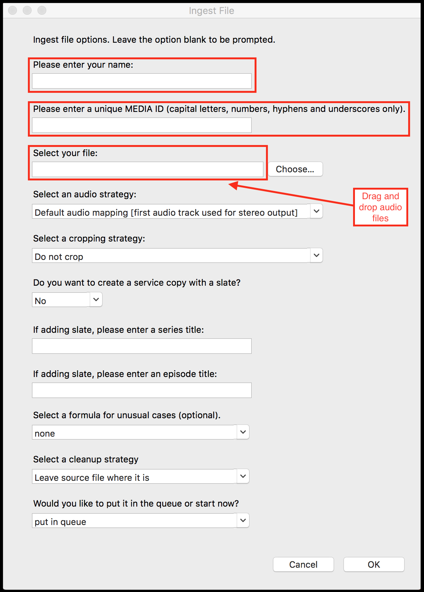
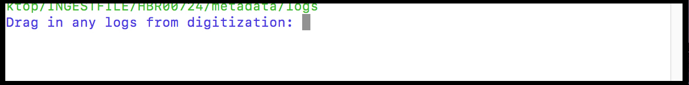

# Ingestfile Workflow. 
  
  
## Overview 

`ingestfile -a` is a process which produces an Archival Information Package for audio assets, including:  

  * md5
  * Technical metadata
  * Presentation file
  * Photo documentation
  * Quality Control

## Workflow

1) Open the Terminal window on the Mac.  

Type:  `ingestfile -a`  Hit "Enter."

2) The ingestfile -a GUI will appear. Populate the first three fields in the GUI; its other eight fields are in the default position (see below). Click "OK."  

*Example, ingestfile -a GUI*. 

3) In the terminal window, you will be prompted to "Drag in any logs from digitization."  Drag the preservation metadata file (Excel) into the Terminal window.  Hit "Enter."

*Example, ingestfile -a promt for digitization logs*

4) In the Terminal window, you will be prompted to "Hit enter to take a photograph."  Adjust the camera and hit "Enter."  If taking multiple photographs, repeat as needed.  

*Example, ingestfile -a promt to take photographs for documentation*. 

5) When finished taking photographs, Hit f to finalize the ingestfile -a process.
